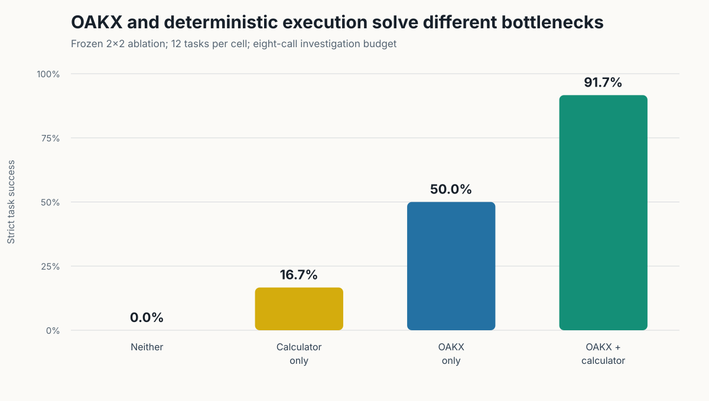

# OAKX Memory-to-Action Study

Reproducible local experiments testing the Oracle Agent Knowledge Exchange
(OAKX): can a governed, Git-backed knowledge repository help fresh agents solve
repository incidents under a fixed investigation budget?

This repository contains the evaluation harness and frozen study artifacts. It
is not the full OAKX production implementation.



## Headline result

On twelve frozen synthetic repository incidents with an eight-call budget:

| OAKX | Deterministic calculator | Strict success |
|---:|---:|---:|
| no | no | 0/12 |
| no | yes | 2/12 |
| yes | no | 6/12 |
| yes | yes | **11/12** |

OAKX achieved 12/12 root-cause identification and authoritative-source
verification. The calculator eliminated every observed numeric execution error;
the remaining failure was categorical output normalization.

## What this repository contains

- `src/oakx_study/`: local Ollama harness, bounded retrieval, deterministic
  grader, and answer-blind calculator.
- `tests/`: research-lock, corpus-isolation, grading, and calculator tests.
- `PROTOCOL.md`: excluded pilot protocol.
- `SCALED_PROTOCOL.md`: frozen twelve-task comparison.
- `ABLATION_PROTOCOL.md`: frozen OAKX × calculator factorial design.
- `runs-scaled/20260830-120856/`: audited scaled results and raw traces.
- `runs-ablation/20260830-123547/`: audited factorial results and raw traces.
- `scripts/make_figures.py`: dependency-free SVG figure generator.

Generated local fixture repositories and invalidated development pilots are
deliberately excluded from version control.

## Reproduce

Requirements: Python 3.11+, Git, Ollama, and the exact model configured in the
JSON files. No third-party Python packages are required.

```bash
PYTHONPATH=src python3 -m unittest discover -s tests -v
python3 scripts/verify_results.py
PYTHONPATH=src python3 -m oakx_study.scaled --config configs/scaled.json
PYTHONPATH=src python3 -m oakx_study.ablation --config configs/ablation.json
python3 scripts/make_figures.py
```

The research lock fails closed if the endpoint is not loopback, model name or
digest changes, another Ollama model is loaded, concurrency differs from one,
or the frozen condition set changes. Agents receive only read-only repository
tools and `finish`; calculator-enabled cells additionally receive a restricted
numeric expression evaluator.

## Scope

These experiments establish a narrow causal result for one quantized local
model, twelve synthetic tasks, one deterministic run per cell, and an eight-call
budget. They do not establish that OAKX outperforms WikiSkill, generalizes across
models, or has completed its autonomous contribution/review loop.

## Release and license

The blog post is pinned to release [`v0.1.0`](https://github.com/curtiscovington/oakx-memory-to-action/tree/v0.1.0).
Code, protocols, and result artifacts are released under the [MIT License](LICENSE).
